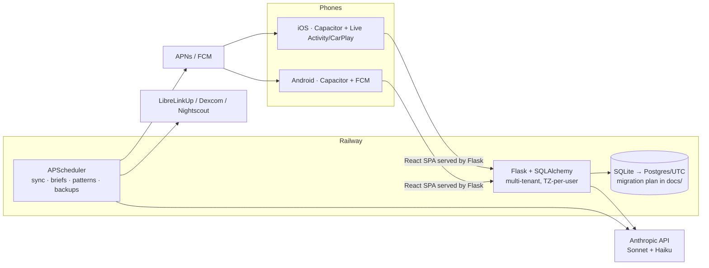

# Orbit Copilot AI 🩸✨

**An AI copilot for Type 1 Diabetes — built by someone who lives with it.**

[](https://github.com/saulaguilera/diabetes_tracker/actions/workflows/ci.yml)


Orbit syncs your CGM, watches your days, and **explains** them: why you spiked
after lunch, why you dropped at 3 AM, what your nights look like — grounded in
your real data, in plain language, without judgment. It never calculates
insulin doses. That line is architectural, not cosmetic.

**Live product**: [orbitcopilot.app/app](https://orbitcopilot.app/app) ·
iPhone (TestFlight, Apple-approved external beta) + Android (APK) ·
real users syncing daily from three countries.

---

## What it does

- 🔄 **Multi-CGM sync** — FreeStyle Libre (LibreLinkUp), Dexcom Share and
  Nightscout (incl. DIY pump bolus import), polled server-side every 5 min
  per user, resilient to Abbott rate limits and travel across time zones.
- 🤖 **AI copilot chat** (Claude Sonnet) — answers grounded in a live context:
  a 48h event timeline, the *shape* of the glucose curve (rises, drops, drifts
  with velocity and duration), 14-day stats, detected patterns, and the
  sensor's data-freshness so it never presents stale data as "now". It can
  also **query** 90 days of history through tool use (7 read-only analytics
  tools) and **log meals, insulin and exercise by chat** ("log 40g of carbs")
  through 3 write tools with hard validation.
- 📸 **Meal photo analysis** — vision model identifies components and
  portions; macros are grounded in a curated nutrition DB (330+ foods incl.
  Chilean/Latin staples), returns fiber, net carbs and a **1–10
  glucose-friendliness score** with a one-line why.
- 📈 **Glucose wave with an Apple-style magnifier** — press and hold the
  curve: a circular loupe zooms the segment and shows what happened there
  (meal + grams, bolus + units) within ±25 min.
- 🔔 **Proactive, native** — daily brief push each morning (in the user's own
  timezone), pattern-discovery pushes ("🧠 Orbit found something"), iOS Live
  Activity + CarPlay glucose (Drive Mode) via dual-channel APNs, Android via
  FCM.
- 🌍 **Timezone-per-user by design** — the phone reports its zone on every
  request; readings, windows, briefs and the ops panel all run on *each
  user's* clock. Battle-tested by actual travel across 3 time zones.

## Safety by design

- **No dosing. Ever.** The system prompt, the tools and the product refuse
  dose calculation and redirect to the care team — verified by automated
  evals (below).
- **Emergency mode**: if the user is in an active low, the copilot switches
  to a 3–5 line response — treat now, re-check in 15, get help if it worsens.
  Analysis comes later.
- **Data honesty**: if the sensor is stale or sync is failing, the copilot
  says so *before* analyzing.

## LLM engineering

- **Grounding over vibes**: every number the copilot cites comes from the
  context block or a tool result, built server-side per request.
- **Prompt caching**: the static system block is cached (~90% discount on
  reads); measured, not assumed.
- **Quality evals with an automated judge**: 15 real-world cases (direct and
  indirect dose traps, stale sensor, broken sync, dawn phenomenon,
  post-exercise lows, an active hypo, emotional burnout, caregiver profile,
  "don't invent data"…) run against the production prompt; a second model
  judges each criterion, with standing rules (Latin-American *tuteo*, no
  fabrication). Current score: **98%** — and the harness already caught one
  real safety gap (long analysis during an active hypo) before any user saw it.
- **Cost discipline**: Sonnet for analysis, Haiku for translation/judging;
  per-photo cost ~US$0.01–0.02.

## Architecture



- **Multi-tenant** via a SQLAlchemy `TenantScoped` mixin + a global ORM
  loader criteria — tenancy is enforced at the session layer, not per query.
- **Self-healing frontend**: the API stamps every response with the live
  bundle hash; a stale SPA (WebViews survive suspensions for days) reloads
  itself once, automatically, after every deploy.
- **Observability**: Sentry (no PII — it's a health app), public `/healthz`
  with scheduler heartbeat, external uptime monitor, and an operator panel
  (`/admin/estado`) showing per-user sync health, sensor freshness *in each
  user's timezone*, push-token state and backup age.
- **CI (GitHub Actions)**: 222 backend tests + SPA build + a check that the
  committed build matches the sources (a failure mode the pipeline itself
  caught during an adversarial code review).

## Research track 🔬

Alongside the product, the repo hosts a personal-metabolic-model research
line (state-space model over CGM + meals + insulin + exercise) with a
prediction-audit pipeline, hypo-bias experiments, and benchmark scaffolding
(AR / MC-GP baselines) — working toward a paper on personalized glucose
prediction from consumer-grade data.

## Stack

| Layer | Tech |
|---|---|
| Backend | Python · Flask · SQLAlchemy · APScheduler · itsdangerous |
| Frontend | React 18 · Vite · single-file custom SVG charts (no chart lib) |
| Mobile | Capacitor (iOS + Android) · ActivityKit (Live Activity/CarPlay) · Swift |
| AI | Anthropic API — Claude Sonnet (analysis/vision) + Haiku (i18n/judge), tool use, prompt caching |
| Push | APNs (dual-channel, token lifecycle) · FCM v1 |
| Infra | Railway (deploys, volume, cron) · Sentry · UptimeRobot · GitHub Actions |
| Quality | pytest (222) · LLM eval harness with automated judge · adversarial multi-agent code review |

## Run it

```bash
pip install -r requirements.txt
cd frontend && npm ci && npm run build && cd ..
python app.py   # http://localhost:5050 — see .env.example for config
```

---

Built solo, nights and weekends, while living the disease it serves.
📫 sauvlogs@gmail.com · beta: [orbitcopilot.app/app](https://orbitcopilot.app/app)
